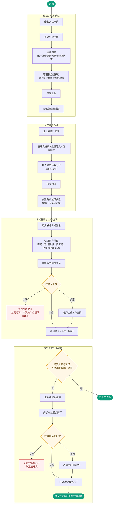

# 企业注册认证与多租户登录方案

> 版本：V2.0  
> 日期：2026-09-14  
> 适用范围：药合作 · 营销协同管理系统  
> 文档状态：方案评审稿  
> 替代对象：《企业码先行登录方案》

## 0. 结论

不建议把“企业码”设计成所有用户登录前必须完成的第一步。

推荐采用业界更常见的“先认证人，再确定工作空间”模型：系统先通过手机号、邮箱、密码、通行密钥、企业微信或企业 SSO 确认用户，再根据用户的企业成员关系确定可进入的企业；只有同时属于多家企业时才展示企业选择。服务专员选择服务药厂发生在进入所属服务商之后，它是业务数据范围选择，不是企业登录，也不是再次认证。

企业码可以保留，但只承担以下辅助能力：

- 邀请链接失效后的人工定位；
- 客服协助、线下培训和存量账号兼容；
- 无法使用手机号、邮箱或企业 SSO 的租户内账号登录；
- 专属部署或企业品牌入口的租户定位。

企业码不是身份凭证，不是企业认证结果，也不应成为跨企业账号体系的核心。

目标流程如下：

```text
企业入驻与认证：企业申请 → 主体核验 → 管理员授权核验 → 开通企业 → 管理员激活

员工加入企业：管理员邀请/导入/目录同步 → 用户验证联系方式或企业身份 → 接受邀请 → 获得成员关系

日常登录：验证用户 → 解析有效成员关系 → 必要时选择企业工作空间 → 进入系统

服务专员：验证用户 → 进入所属服务商 → 必要时选择服务药厂 → 进入对应业务数据范围
```

### 0.1 总流程图



## 1. 对现有企业码先行方案的评估

### 1.1 现有方案解决了什么

现有方案准确识别了三个真实约束：

- 当前账号、组织和权限数据按企业隔离；
- 手机号与企业、角色、服务药厂之间不是简单的一对一关系；
- 所属企业、角色授权、当前服务药厂必须在产品和数据模型中分开。

其中“服务专员所属服务商不变，服务药厂只是当前业务数据范围”应当保留。这是正确的业务建模。

### 1.2 不建议继续采用的部分

| 问题 | 现有方案 | 影响 | 建议 |
| --- | --- | --- | --- |
| 登录入口 | 所有人先输入企业码 | 给每位用户永久增加一次租户定位和记忆负担 | 默认先验证用户，只有多企业时才选择工作空间 |
| 概念边界 | 企业码同时承担入口、定位和安全边界 | 容易被误认为认证因素或企业可信证明 | 企业码只做公开定位符，不参与身份可信度判断 |
| 账号模型 | V1 企业账号独立，V2 再补全局人员 | 跨企业体验、账号恢复、扫码绑定都需要二次改造 | 从第一版建立稳定全局用户 ID，企业账号迁移为成员关系 |
| 跨企业关联 | 在 A 企业内输入 B 企业码和 B 账号密码 | 增加凭证暴露面，也把账号合并责任交给用户 | 对两个账号分别完成受控认证，再由系统合并或人工审核 |
| 角色处理 | 登录后默认选择角色 | 角色通常是权限集合，不应成为每次登录必选项 | 权限默认合并生效；只有互斥岗位或不同工作台才选择“工作身份” |
| 注册激活 | 管理员生成初始密码，首次登录改密 | 初始密码容易被转发、长期未改或泄露 | 使用一次性邀请链接或验证码，由用户自行绑定凭证 |
| 密码规则 | 字母数字混合、90 天过期 | 增加用户负担，且不符合当前主流安全建议 | 长口令、泄露密码拦截、限速；仅在泄露或风险事件后强制更换 |
| 短信登录 | 可作为普遍登录方式 | 对管理员、合规和财务等高权限账号强度不足 | 普通用户可用，敏感角色强制 MFA 或抗钓鱼凭证 |
| 扫码绑定 | `(provider, provider_userid)` 全局唯一 | 企业微信等企业身份具有签发方上下文，可能误绑 | 唯一键使用 `(provider, issuer, subject)` |
| 企业名称匹配 | 可按简称或名称定位企业 | 正式环境易枚举企业，且重名与更名会产生歧义 | 只在入驻检索中使用；登录不做企业名称模糊匹配 |
| 实施顺序 | SSO、邀请、找回、MFA 放在后续版本 | V1 上线即缺少完整账号生命周期 | V1 必须包含邀请激活、找回、离职停用和管理员交接 |

### 1.3 核心判断

“当前数据库没有全局人员表”是迁移约束，不应被固化成长期产品交互。登录体验不应替底层表结构偿债。可以保留现有企业账号表作为兼容层，同时增加轻量身份目录和成员关系映射，不需要一次性合并所有业务数据。

## 2. 统一概念模型

设计前必须把以下概念分开：

| 概念 | 回答的问题 | 示例 |
| --- | --- | --- |
| 企业主体 | 这家机构在法律和平台业务上是谁 | 东方恒业推广有限公司 |
| 企业认证 | 平台凭什么相信企业资料和申请人有权代表企业 | 统一社会信用代码核验、电子营业执照授权、人工审核 |
| 用户 | 当前操作的是哪个系统主体 | `user_id=usr_xxx` |
| 登录凭证 | 用户如何证明自己控制该账号 | 通行密钥、密码、短信验证码、企业微信、OIDC/SAML |
| 企业成员关系 | 用户属于哪家企业、状态如何 | 用户是东方恒业的在职成员 |
| 角色授权 | 成员在企业内能做什么 | 服务商管理员、工作组长、服务专员 |
| 当前工作空间 | 本次会话正在以哪家企业开展工作 | 东方恒业推广有限公司 |
| 当前服务药厂 | 服务专员本次操作哪家药厂的数据 | 百益制药 |
| 资质认证 | 企业或人员是否具备某项业务资格 | 营业执照、业务准入材料、有效期与审核记录 |

手机号验证只能证明用户当时控制该手机号，不能单独证明自然人真实身份；统一社会信用代码可以定位企业主体，也不能单独证明申请人有权代表企业。认证流程必须根据要证明的事实选择证据。

## 3. 总体架构

### 3.1 推荐领域模型

```text
User 全局用户
  ├─ Credential 登录凭证
  │    ├─ Password
  │    ├─ Passkey
  │    ├─ Phone OTP
  │    └─ External Identity 企业微信/OIDC/SAML
  │
  └─ Membership 企业成员关系
       ├─ Enterprise 企业
       ├─ Department 部门挂靠
       ├─ RoleAssignment 角色授权
       └─ WorkspacePreference 最近工作空间

Enterprise 企业
  ├─ EnterpriseVerification 主体认证记录
  ├─ Qualification 业务资质记录
  ├─ EnterpriseAdmin 管理员关系
  └─ ServiceRelationship 企业间合作关系
       └─ SpecialistScope 服务专员可服务药厂范围
```

### 3.2 建模原则

- `user_id` 使用系统生成、不可推测、永不复用的稳定 ID；手机号和邮箱只是可变登录标识。
- `membership` 才是用户与企业的关系，角色不能直接挂在全局用户上。
- `role_assignment` 是授权，不默认等同于登录身份；同一成员可同时拥有多个角色。
- `current_enterprise_id` 和 `current_serving_pharma_id` 是会话上下文，不是用户主数据。
- 企业主体认证、业务资质认证、用户登录认证分别留存状态与证据，不能用一个 `verified` 字段混合表达。
- 外部身份以签发方和主体组合唯一，例如企业微信至少需要企业标识与成员标识，OIDC 使用 `issuer + subject`。

## 4. 企业注册与主体认证

药合作属于明确的 B2B 协作系统，V1 推荐“申请或商务开通 + 审核”，不开放任何人注册后立即创建正式企业。

### 4.1 企业入驻主流程

```text
1. 发起申请
   商务创建入驻单，或申请人在官网提交企业申请
        ↓
2. 核验企业主体
   企业名称 + 统一社会信用代码 + 登记状态
        ↓
3. 核验申请人代表权限
   电子营业执照授权 / 法定代表人确认 / 加盖公章授权书 + 人工复核
        ↓
4. 审核业务资质
   根据企业类型收集必要材料，单独记录资质类别、有效期和审核结果
        ↓
5. 创建企业与首位管理员
   企业状态变为“待激活”，发送一次性管理员激活邀请
        ↓
6. 管理员激活
   验证手机号或企业邮箱 → 绑定通行密钥/密码 → 配置 MFA → 接受协议
        ↓
7. 企业启用
   状态变为“正常”，管理员开始邀请员工
```

### 4.2 企业主体核验

至少采集并核验：

- 企业法定名称；
- 统一社会信用代码；
- 登记状态；
- 企业类型；
- 法定代表人或负责人信息，仅在代表权限核验确有必要时使用；
- 申请来源、核验来源、核验时间和核验结果。

统一社会信用代码应作为企业业务主标识之一，但数据库仍使用内部 `enterprise_id` 作为主键。企业更名不改变 `enterprise_id`；主体注销、吊销或迁移时通过状态机处理，不删除历史记录。

可使用国家企业信用信息公示系统核对公开登记信息。公示系统支持按企业名称、统一社会信用代码或注册号查询市场主体信息。企业代表权限可优先接入电子营业执照授权；国家市场监管总局相关系统已提供电子营业执照扫码和事项授权的交互参考。

### 4.3 申请人代表权限核验

主体存在不等于申请人有权开通系统。按优先级采用：

1. 电子营业执照扫码并对具体事项授权；
2. 已备案法定代表人或管理员通过可信渠道确认；
3. 加盖公章的授权书 + 经办人身份核验 + 人工复核；
4. 商务合同中的明确管理员联系人，经内部审批后导入。

核验完成后生成独立的 `admin_authority_verification` 记录，包含授权人、被授权人、授权范围、有效期、证据摘要和审核人。管理员变更必须走交接或重新核验，不能只修改一个手机号。

### 4.4 业务资质认证

企业主体认证只证明“企业是谁”，不能替代药企、服务商或其他角色的业务准入。资质采用可配置清单：

```text
qualification_type
qualification_number
issuer
valid_from
valid_to
status: pending / verified / rejected / expired / revoked
evidence_file_id
verified_by
verified_at
```

具体要求由业务与法务按企业类型确认，账号系统只提供通用能力。到期、撤销和补件必须可追踪，并可触发限制高风险业务，但不应直接删除企业或历史记录。

### 4.5 企业状态

```text
draft → pending_verification → pending_activation → active
                                  ↓
active → suspended → active
active → terminated
```

- `draft`：资料未提交；
- `pending_verification`：等待主体、代表权限或资质审核；
- `pending_activation`：审核通过，首位管理员未激活；
- `active`：正常使用；
- `suspended`：暂停新登录或限制部分业务，保留审计；
- `terminated`：终止服务，只允许受控查询和数据处置流程。

## 5. 用户注册与加入企业

### 5.1 推荐原则

药合作中的“注册”不等于自由创建企业账号。普通用户应通过企业邀请、管理员导入或企业身份源同步获得成员关系。用户先建立或认领全局账号，再接受加入企业的授权。

### 5.2 方式一 管理员邀请

这是 V1 默认方式。

```text
管理员填写姓名 + 手机号/邮箱 + 部门 + 预设角色
→ 系统生成一次性邀请令牌并发送链接
→ 用户打开链接，页面已包含企业上下文，不再输入企业码
→ 用户验证手机号/邮箱或使用已有账号登录
→ 用户确认加入企业并绑定凭证
→ 系统创建或激活 membership
→ 根据邀请创建角色授权并写审计日志
```

邀请令牌必须一次性使用、服务端只保存摘要、有明确有效期、可撤销，并绑定企业、受邀标识和邀请目的。邀请被转发时，仍需验证预期手机号、邮箱或企业身份。

### 5.3 方式二 批量导入

管理员导入人员并不会直接生成通用初始密码，而是批量创建 `pending` 成员关系并发送激活邀请。导入需要预校验、错误行回执、重复成员合并规则和可追踪批次号。

### 5.4 方式三 企业目录同步

中大型客户优先支持企业微信通讯录、OIDC/SAML 单点登录以及后续 SCIM 同步。登录协议解决认证，目录同步解决用户和群组的创建、更新、停用，两者不能混为一谈。SCIM RFC 7644 专门定义了跨域环境中的用户和群组配置管理，可作为后续标准接口。

### 5.5 方式四 受限自助申请

自助申请只创建待审核记录，不直接获得正式企业成员权限：

- 已有企业：申请加入，企业管理员审批；
- 未入驻企业：创建企业入驻申请，进入主体认证；
- 外部协作人员：由合作关系的责任企业发起邀请，不允许自行认领药厂；
- 演示或试用：进入独立试用租户，不与生产企业数据混用。

### 5.6 激活与找回

- 不发送默认密码或明文初始密码；
- 用户通过一次性链接或验证码证明联系方式控制权；
- 首次激活后绑定密码、通行密钥或企业 SSO；
- 高权限成员在首次进入前配置 MFA；
- 找回流程不泄露账号是否存在，完成找回后撤销旧会话并通知用户；
- 手机号变更必须在已登录状态下重新认证，或由企业管理员与平台客服执行双人复核。

## 6. 日常登录方案

### 6.1 默认入口

登录首页不要求企业码，提供：

- 手机号、邮箱或账号；
- 密码登录；
- 验证码登录；
- 通行密钥登录；
- 企业微信扫码；
- “企业单点登录”入口；
- 辅助入口“使用企业码或专属地址登录”。

对支持企业 SSO 的客户，邀请链接、企业专属域名或已验证邮箱域名可直接完成身份提供方发现并跳转，不要求用户记忆企业码。

### 6.2 标准登录状态机

```text
开始
  ↓
识别登录方式
  ├─ 本地凭证：手机号/邮箱/账号 + 密码/验证码/通行密钥
  └─ 联合身份：企业微信/OIDC/SAML
  ↓
完成用户认证
  ↓
加载有效 membership
  ├─ 0 个：显示“暂无可用企业”，提供接受邀请/申请加入/联系管理员
  ├─ 1 个：直接进入该企业
  └─ 多个：显示“选择工作空间”，默认选中最近使用项
  ↓
解析工作身份
  ├─ 普通成员：合并其有效角色权限后进入工作台
  └─ 互斥岗位或不同工作台：仅此时选择“当前工作身份”
  ↓
服务专员解析服务药厂
  ├─ 0 家：阻止进入业务页并提示联系管理员
  ├─ 1 家：直接进入
  └─ 多家：选择当前服务药厂
  ↓
签发带企业和数据范围上下文的会话
```

### 6.3 为什么角色不应默认逐次选择

角色是权限分配结果。大多数情况下，同一成员的多个有效角色应按授权模型合并生效，系统根据首页和菜单权限展示能力。只有以下情况才需要用户选择：

- 两个身份依法或按内控制度必须互斥；
- 不同身份进入完全不同的工作台；
- 切换身份会改变数据范围，且需要用户明确知情；
- 需要模拟“以某岗位操作”并形成独立审计上下文。

界面文案应使用“工作身份”或“工作空间”，不要把普通 RBAC 角色包装成登录账号。

### 6.4 企业切换

已登录用户通过工作空间切换器选择其有效成员关系。系统不再次收集另一企业的密码，而是换发新的企业上下文会话。

以下情况执行重新认证或增强认证：

- 距离上次主动认证超过策略阈值；
- 切换到平台管理员、企业管理员、合规、财务等敏感权限；
- 新设备、异常位置或高风险行为；
- 修改凭证、成员关系、支付信息或关键审批配置。

### 6.5 企业码兼容入口

企业码只放在二级入口：

```text
使用企业码或专属地址登录
→ 输入企业码
→ 定位企业的登录策略
→ 本地账号登录，或跳转该企业 SSO
```

规则：

- 企业码由系统生成，可设置易记别名，但不是秘密；
- 不支持企业名称模糊搜索；
- 错误响应和耗时尽量一致，避免企业与账号枚举；
- 邀请链接和专属域名已包含企业上下文时不再显示企业码输入；
- 企业码不能出现在授权判断和业务数据隔离条件中，后台统一使用内部 `enterprise_id`。

## 7. 认证与授权分级

| 场景 | 需要证明什么 | 推荐方式 | 不足以单独证明 |
| --- | --- | --- | --- |
| 企业主体入驻 | 企业真实存在且状态有效 | 统一社会信用代码 + 权威登记信息核验 | 企业简称、企业码 |
| 首位管理员开通 | 申请人有权代表企业 | 电子营业执照事项授权、法定代表人确认或授权书人工复核 | 仅知道企业信息 |
| 普通员工加入 | 企业同意该用户成为成员 | 管理员邀请、目录同步或审批 | 用户自行填写企业码 |
| 用户日常登录 | 用户控制已绑定凭证 | 通行密钥、密码 + MFA、企业 SSO、受控短信验证码 | 仅输入手机号或企业码 |
| 高风险操作 | 当前操作者仍在场且达到更高保证级别 | 重新认证 + MFA/通行密钥 | 仅依赖长期会话 |
| 服务药厂访问 | 企业合作与人员授权仍然有效 | 有效合作关系 + 服务专员范围授权 | 用户上次选择记录 |

## 8. 安全基线

### 8.1 密码与通行密钥

- 密码单因素使用时最少 15 个字符；作为 MFA 的一部分时最少 8 个字符；
- 允许至少 64 个字符、空格和常用 Unicode，不强制大小写、数字、特殊字符组合；
- 检查常见或已泄露密码，支持密码管理器、自动填充和粘贴；
- 不做固定 90 天周期改密，仅在泄露、找回、可疑活动或管理员重置后强制更换；
- 使用抗离线破解的加盐密码哈希并设置合适成本；
- 优先支持基于 WebAuthn 的通行密钥，为管理员和高风险角色提供抗钓鱼认证。

### 8.2 MFA 策略

- 平台管理员、企业管理员：必须启用 MFA，优先通行密钥或安全密钥；
- 合规、财务、关键审批人员：登录或敏感操作时增强认证；
- 普通员工：风险触发或企业策略要求时启用；
- 短信验证码可作为低风险登录或恢复因素，但不作为最高权限账号的唯一保护；
- 恢复码只展示一次，服务端保存摘要，并允许用户撤销。

### 8.3 防枚举和自动化攻击

- 登录、注册、找回均使用不暴露账号状态的外部文案；
- 同时按账号、IP、设备、企业和风险信号限速，避免只按企业码封禁造成拒绝服务；
- 验证码只在风险升高时启用，不使用固定次数作为唯一判断；
- 对短信发送设置日限额、单账号限额、设备限额和防轰炸措施；
- 记录失败原因供内部风控和客服查看，对外只返回稳定错误分类。

### 8.4 会话与租户隔离

- Web 会话使用 `HttpOnly`、`Secure`、合理 `SameSite` 的 Cookie；
- 登录、切换企业、提升身份和增强认证后轮换会话标识；
- 服务端从会话读取 `user_id`、`enterprise_id` 和授权快照，不信任前端传入的租户参数；
- 每次请求校验成员关系、企业状态及必要的权限版本；
- 停用用户、回收角色、暂停合作关系后，使相关会话及时失效；
- 审计日志记录操作者、企业、工作身份、当前服务药厂、认证强度和关键变更前后值。

### 8.5 个人信息最小化

个人信息保护法要求处理目的明确、与目的直接相关并限制在最小范围；生物识别、医疗健康等属于敏感个人信息，需要特定目的、充分必要性和严格保护措施。因此：

- 普通账号激活不默认采集身份证、人脸或银行卡；
- 只有首位管理员代表权限核验、法律要求或明确高风险业务需要时才提升实名强度；
- 身份证件、人脸核验结果和原始影像分级存储，设置访问审批、留存期限和删除规则；
- 业务数据中的医疗健康信息与账号目录分域、分权管理；
- 对第三方认证服务记录处理目的、字段范围、保存位置和委托处理责任。

## 9. 数据模型建议

### 9.1 核心实体

```sql
user (
  id, status, display_name, created_at, updated_at
)

login_identifier (
  id, user_id, type, normalized_value, verified_at, status
)

credential (
  id, user_id, type, secret_hash_or_key, status,
  bound_at, last_used_at, compromised_at
)

external_identity (
  id, user_id, provider, issuer, subject, claims_snapshot, status,
  UNIQUE(provider, issuer, subject)
)

enterprise (
  id, legal_name, unified_social_credit_code, type, status,
  UNIQUE(unified_social_credit_code)
)

enterprise_verification (
  id, enterprise_id, verification_type, source, status,
  evidence_ref, verified_by, verified_at, expires_at
)

membership (
  id, user_id, enterprise_id, member_no, department_id, status,
  joined_at, left_at,
  UNIQUE(user_id, enterprise_id)
)

invitation (
  id, enterprise_id, target_type, target_hash, token_hash,
  intended_roles, expires_at, accepted_at, revoked_at
)

role_assignment (
  id, membership_id, role_id, scope_type, scope_ref,
  effective_from, effective_to, status
)

service_relationship (
  id, provider_enterprise_id, pharma_enterprise_id, status,
  effective_from, effective_to
)

specialist_scope (
  id, membership_id, service_relationship_id, status,
  effective_from, effective_to
)
```

### 9.2 唯一性与账号合并

- 手机号和邮箱可以作为已验证登录标识，但不能作为数据库主键；
- 是否允许同一手机号绑定多个全局用户应形成明确策略。默认不允许新建重复账号，但保留共享号码、号码回收和历史脏数据的人工处理通道；
- 不因手机号相同自动合并存量账号，避免号码回收或录入错误导致越权；
- 存量账号合并必须分别验证两个账号，展示将合并的企业成员关系，并保留审计与回滚标记；
- 外部身份的 `subject` 只在其 `issuer` 内稳定唯一，不能脱离签发方使用。

## 10. 服务接口边界

```text
POST /auth/identify                 识别可用登录策略，不泄露账户状态
POST /auth/password                 密码认证
POST /auth/otp/request              请求验证码
POST /auth/otp/verify               验证验证码
POST /auth/passkey/options          获取通行密钥挑战
POST /auth/passkey/verify           验证通行密钥
GET  /auth/federation/{provider}    发起企业微信/OIDC/SAML 登录
GET  /auth/callback/{provider}      处理联合身份回调

GET  /me/memberships                获取当前用户有效企业成员关系
POST /session/workspace             选择或切换企业工作空间
POST /session/work-identity         仅在需要时选择互斥工作身份
POST /session/serving-pharma        选择服务药厂数据范围
POST /session/step-up               发起增强认证

POST /enterprise-applications       提交企业入驻申请
POST /enterprise-verifications      提交或执行主体认证
POST /invitations                   创建邀请
POST /invitations/{token}/accept    接受邀请
POST /memberships/{id}/disable      停用成员
```

`/auth/identify` 只能返回“下一步需要哪种认证”的抽象策略，不能返回完整企业列表或“该手机号是否存在”。只有完成用户认证后，`/me/memberships` 才能返回企业成员关系。

## 11. 关键异常处理

| 场景 | 处理方式 |
| --- | --- |
| 手机号属于多家企业 | 认证后展示工作空间，不要求重复登录 |
| 同一人在同企业有多个角色 | 默认合并有效授权；仅互斥岗位选择工作身份 |
| 服务专员服务多家药厂 | 进入所属服务商后选择服务药厂 |
| 服务专员没有有效药厂 | 可进入个人/消息区域，但禁止访问药厂业务数据，并给出责任管理员 |
| 企业暂停 | 阻止新业务会话；根据合同与合规要求保留受控只读和数据导出流程 |
| 管理员离职 | 先完成管理员交接，再停用成员和撤销凭证 |
| 手机号换号或被运营商回收 | 不自动转移账号；走已登录改绑或人工复核 |
| 邀请链接被转发 | 必须再次验证目标手机号、邮箱或企业身份 |
| 企业 SSO 暂时不可用 | 按企业策略启用受控应急管理员账号，并强制 MFA 与完整审计 |
| 企业微信用户重建 | 依据签发方、稳定主体标识和管理员确认重新绑定，不按姓名自动匹配 |

## 12. 分阶段落地

### Phase 0 数据审计与契约确认

- 盘点现有企业、账号、手机号、外部身份和角色重复情况；
- 确认手机号当前是否全局唯一、企业内唯一或无约束；
- 明确服务商与药厂合作关系的唯一事实源；
- 定义全局 `user_id`、`membership_id` 和现有账号 ID 的映射；
- 固化停用、离职、企业暂停、合作终止后的会话失效规则。

### Phase 1 V1 闭环

必须一次交付可运行的账号生命周期：

- 轻量全局用户目录；
- 企业成员关系；
- 管理员邀请和一次性激活；
- 手机号/邮箱 + 密码或验证码登录；
- 登录后工作空间解析；
- 服务专员选择服务药厂；
- 找回、停用、离职和管理员交接；
- 基础 MFA、限速、审计和会话撤销；
- 企业码作为兼容二级入口。

### Phase 2 企业认证与联合身份

- 企业入驻申请、主体认证和资质有效期管理；
- 电子营业执照或等效授权核验；
- 企业微信与 OIDC/SAML 单点登录；
- 企业专属域名和身份提供方发现；
- 批量导入与企业目录同步。

### Phase 3 强认证与自动化治理

- WebAuthn 通行密钥；
- SCIM 用户与群组同步；
- 风险自适应认证；
- 自动离职停用、资质到期与合作终止联动；
- 权限版本化、异常访问检测和账号合并工具。

## 13. 产品验收标准

### 13.1 用户体验

- 单企业用户完成认证后直接进入，不出现企业选择；
- 多企业用户只在认证后选择工作空间；
- 邀请用户不输入企业码，链接自动带入企业上下文；
- 单角色用户不出现角色确认页；
- 单一有效服务药厂的服务专员直接进入；
- 所有切换页面明确展示“所属企业、当前工作身份、当前服务药厂”。

### 13.2 安全与合规

- 企业码、企业名称、手机号和邮箱均不可被批量枚举；
- 管理员账号 MFA 覆盖率为 100%；
- 邀请令牌一次性、可撤销、过期后不可使用；
- 离职停用、角色回收、合作暂停后旧会话在目标时限内失效；
- 不存在明文初始密码、固定周期强制改密和仅凭手机号自动合并账号；
- 关键认证、授权、切换和恢复动作均可审计。

### 13.3 架构

- 业务接口不接受客户端传入的企业 ID 作为最终授权依据；
- 同一用户可拥有多个企业成员关系；
- 外部身份使用 `provider + issuer + subject` 唯一定位；
- 企业认证、用户认证、成员关系、角色授权、服务药厂范围均可独立变更；
- 存量企业账号无需一次性重写即可映射到新模型。

## 14. 需要评审拍板的事项

1. 正式企业是否只允许商务/平台发起，还是开放“提交申请但不即时开通”；
2. 各企业类型的主体和业务资质清单，以及哪些资质会阻止登录、哪些只限制业务操作；
3. 首位管理员代表权限核验采用电子营业执照、授权书人工审核还是两者并行；
4. 手机号是否作为全局唯一登录标识，以及共享号码与历史重复数据的处理规则；
5. 哪些角色必须启用 MFA，哪些操作必须增强认证；
6. 多角色默认权限合并规则，以及是否存在必须互斥的工作身份；
7. 企业、成员、角色、合作关系发生状态变化时，会话失效的目标时限；
8. 企业微信、OIDC/SAML 和 SCIM 的客户优先级与实施顺序。

## 15. 参考依据

- [NIST SP 800-63-4 Digital Identity Guidelines](https://pages.nist.gov/800-63-4/)：身份校验、认证保证级别、凭证和联合身份的总体框架。
- [NIST SP 800-63B Authenticator Requirements](https://pages.nist.gov/800-63-4/sp800-63b/authenticators/)：密码长度、泄露密码拦截、避免固定周期改密、限速和抗钓鱼认证要求。
- [OWASP Authentication Cheat Sheet](https://cheatsheetseries.owasp.org/cheatsheets/Authentication_Cheat_Sheet.html)：通用错误、重新认证、MFA、自动化攻击防护和会话轮换实践。
- [OpenID Connect Core 1.0](https://openid.net/specs/openid-connect-core-1_0.html)：联合身份中签发方、主体标识、认证与授权边界。
- [W3C Web Authentication Level 3](https://www.w3.org/TR/webauthn-3/)：基于公钥凭证和通行密钥的注册与认证模型。
- [IETF RFC 7644 SCIM Protocol](https://datatracker.ietf.org/doc/html/rfc7644)：跨域用户和群组的标准化配置管理。
- [国家企业信用信息公示系统](https://www.gsxt.gov.cn/)：企业名称、统一社会信用代码和登记信息查询入口。
- [全国经营主体登记注册服务网](https://dj.samr.gov.cn/djfww/)：电子营业执照、企业身份验证和自然人实名认证服务入口。
- [中华人民共和国个人信息保护法](https://www.cac.gov.cn/2021-08/20/c_1631050028355286.htm)：个人信息处理的目的明确、最小必要以及敏感个人信息保护要求。

## 附录 A 与原企业码方案的取舍

| 原方案能力 | 处理结论 | 新位置 |
| --- | --- | --- |
| 企业码定位 | 保留但降级 | 二级兼容登录入口 |
| 最近企业 | 保留 | 认证后的工作空间偏好 |
| 跨企业切换 | 保留并重构 | 基于 membership 换发会话，不输入另一企业密码 |
| 扫码登录 | 保留并加强 | 按签发方和主体映射全局用户，再解析成员关系 |
| 单角色确认页 | 删除 | 单角色直接进入 |
| 多角色选择 | 条件保留 | 仅互斥工作身份或不同工作台使用 |
| 服务药厂选择 | 保留 | 所属服务商内的业务数据范围选择 |
| 企业内独立账号 | 兼容但不作为目标模型 | 映射为全局用户 + 企业成员关系 |
| 企业名称模糊登录 | 删除 | 仅企业入驻查询使用 |
| 初始密码 | 删除 | 一次性邀请激活 |
| 90 天强制改密 | 删除 | 泄露或风险事件触发改密 |
| SSO/MFA/找回后置 | 调整 | 找回与基础 MFA 进入 V1，SSO 按客户优先级进入 Phase 2 |

## 附录 B 推荐页面顺序

```text
页面 1 登录
  手机号/邮箱/账号
  密码 / 验证码 / 通行密钥
  企业微信扫码
  企业单点登录
  辅助入口：使用企业码或专属地址登录

页面 2 选择工作空间（仅多企业用户）
  企业名称 + 企业类型 + 成员状态 + 最近使用

页面 3 选择工作身份（仅互斥身份或不同工作台）
  工作身份 + 数据范围 + 有效期

页面 4 选择服务药厂（仅多药厂服务专员）
  药厂 + 合作状态 + 工作组 + 服务区域 + 最近使用

页面 5 工作台
  顶部持续展示并允许切换：所属企业 / 工作身份 / 服务药厂
```
